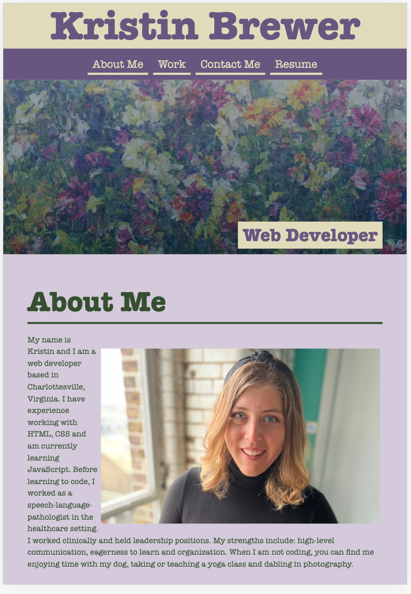
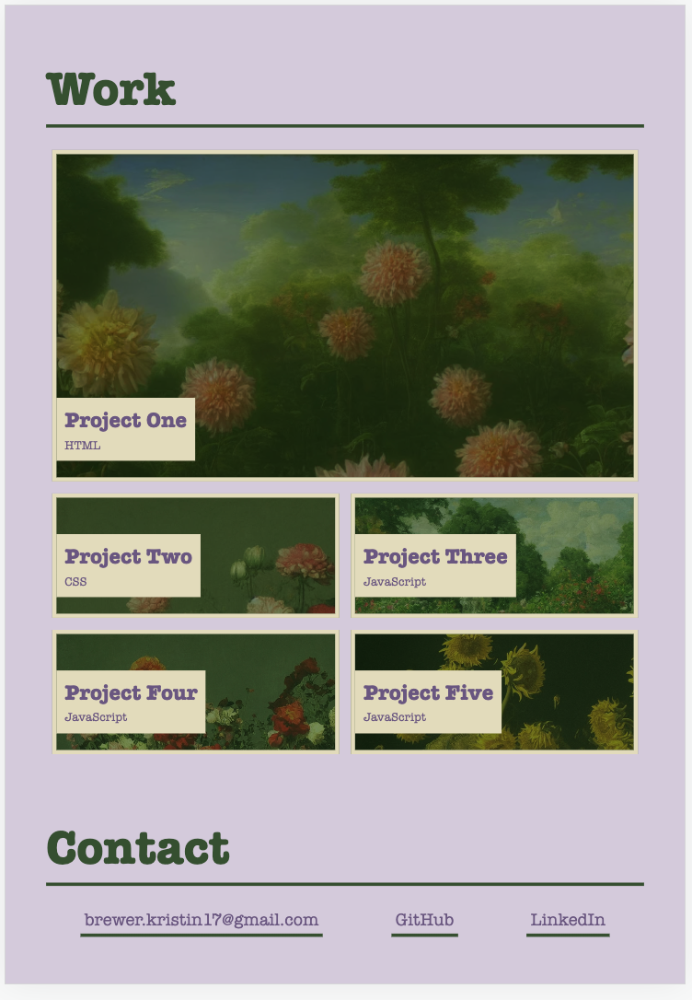

# Portfolio Challange, Module 2
Webpage portfolio

## Description
This is a bootcamp webapge design challenge that has provided example code from which I based my code to create a portfolio-style webpage. This webpage includes links to page sections of About Me, Work, and Contact. There are place holders for future external links for Resume and projects. This includes a photo, short biography, project place holders and contact section.

## Mockup

## Installation
N/a

## Usage
To practice generating HTML and CSS code. 

## Credits

N/A

## License 

Please refer to the Licesnse in the repo. 